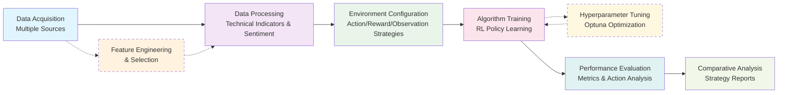
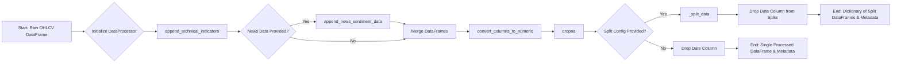

<!-- omit in toc -->
# QuantRL-Lab
A Python testbed for Reinforcement Learning in finance, designed to enable researchers and developers to experiment with and evaluate RL algorithms in financial contexts. The project emphasizes modularity and configurability, allowing users to tailor the environment, data sources, and algorithmic settings to their specific needs

## Table of Contents
- [Table of Contents](#table-of-contents)
  - [Motivation](#motivation)
  - [Example usage:](#example-usage)
  - [Roadmap 🔄](#roadmap-)
  - [Setup Guide](#setup-guide)
  - [Development \& Publishing](#development--publishing)
  - [Literature Review](#literature-review)

### Motivation

**Addressing the Monolithic Environment Problem**

Most existing RL frameworks for finance suffer from tightly coupled, monolithic designs where action spaces, observation spaces, and reward functions are hardcoded into the environment initialization. This creates several critical limitations:

- **Limited Experimentation**: Users cannot easily test different reward formulations or action spaces without doing a lot of rewriting of the environments
- **Poor Scalability**: Adding new asset classes, trading strategies, or market conditions requires significant code restructuring
- **Reduced Reproducibility**: Inconsistent interfaces across different environment configurations make fair comparisons difficult
- **Development Overhead**: Simple modifications like testing different reward functions or adding new observation features require extensive refactoring


<u>The framework tries to demonstrate the following workflow:</u>
1. **Flexible Data Acquisition**: Aggregate market data from multiple heterogeneous sources with unified interfaces
2. **Feature Engineering**: Systematic selection and analysis of technical indicators (based on vectorized backtesting) for optimal signal generation
3. **Data Processing**: Enrich datasets with technical indicators and sentiment analysis from news sources
4. **Environment Configuration**: Define trading environments with customizable parameters (portfolio allocation, transaction costs, slippage, observation windows)
5. **Algorithm Training & Tuning**: Execute RL algorithm training with preset or configurable hyperparameters
6. **Performance Evaluation**: Assess model performance and action distribution
7. **Comparative Analysis**: Generate detailed performance reports




---


### Example usage:

```python
# Easily swappable strategies for experimentation
# For in depth example, please refer to the backtesting_example.ipynb

sample_env_config = BacktestRunner.create_env_config_factory(
    train_data=train_data_df,
    test_data=test_data_df,
    action_strategy=action_strategy,
    reward_strategy=reward_strategies["conservative"],
    observation_strategy=observation_strategy,
    initial_balance=100000.0,
    transaction_cost_pct=0.001,
    window_size=20
)

runner = BacktestRunner(verbose=1)

# Single experiment
results = runner.run_single_experiment(
    SAC,          # Algorithm to use
    sample_env_config,
    # config=custom_sac_config,  # an optional input arg
    total_timesteps=50000,  # Total timesteps for training
    num_eval_episodes=3
)

BacktestRunner.inspect_single_experiment(results)

# More combinations
presets = ["default", "explorative", "conservative"]

algorithms = [PPO, A2C, SAC]

comprehensive_results = runner.run_comprehensive_backtest(
    algorithms=algorithms,
    env_configs=env_configs,
    presets=presets,
    # custom_configs=custom_configs,  # either use presets or customize config by yourself
    total_timesteps=50000,
    n_envs=4,
    num_eval_episodes=3
)
```

For more detailed use cases, please refer to the notebooks:
- Feature and window size selection: [`notebooks/feature_selection.ipynb`](notebooks/feature_selection.ipynb)
- Data processing example: [`notebooks/data_processing.ipynb`](notebooks/data_processing.ipynb)
- Backtesting: [`notebooks/backtesting_example.ipynb`](notebooks/backtesting_example.ipynb)
- Hyperparameter tuning for stablebaseline algo: [`notebooks/hyperparameter_tuning.ipynb`](notebooks/hyperparameter_tuning.ipynb)
- LLM hedge pair screener (for upcoming multi stock env): [`notebooks/llm_hedge_screener.ipynb`](notebooks/llm_hedge_screener.ipynb)


---

### Roadmap 🔄
- **Data Source Expansion**:
  - Complete Integration for more (free) data sources
  - Add Cryto data support
  - Add OANDA forex data support
- **Technical Indicators**:
  - Add more indicators (Ichimoku, Williams %R, CCI, etc.)
- **Trading Environments**:
  - (In-progress) Multi-stock trading environment with hedging pair capabilities
- **Alternative Data for consideration in observable space**:
  - Fundamental data (earnings, balance sheets, income statements, cash flow)
  - Macroeconomic indicators (GDP, inflation, unemployment, interest rates)
  - Economic calendar events
  - Sector performance data

---

### Setup Guide

1. Clone the Repository
```bash
git clone https://github.com/whanyu1212/QuantRL-Lab.git
```

2. Install Poetry for dependency management
```bash
curl -sSL https://install.python-poetry.org | python3 -
```

3. Sync dependencies (It also installs the current project in dev mode)
```bash
poetry install
```

4. Activate virtual environment (Note that the `shell` command is deprecated in the latest poetry version)
```bash
poetry env activate
# a venv path will be printed in the terminal, just copy and run it
# e.g.,
source /home/codespace/.cache/pypoetry/virtualenvs/multi-agent-quant-cj6_z41n-py3.12/bin/activate
```

5. Install jupyter kernel
```bash
# You can change the name and display name according to your preference
python -m ipykernel install --user --name multi-agent-quant --display-name "Multi Agent Quant"
```

6. Set up environment variables
```bash
# Copy the example environment file
cp .env.example .env

# Open .env file and replace the placeholder values with your actual credentials
# You can use any text editor, here using VS Code
code .env
```

Make sure to replace all placeholder values in the `.env` file with your actual API keys and credentials. Never commit the `.env` file to version control.

<br>

7. Set up pre-commit hooks
```bash
# Install pre-commit
poetry add pre-commit

# Install the git hooks
pre-commit install

# Optional: run pre-commit on all files
pre-commit run --all-files
```

The pre-commit hooks will check for:
- Code formatting (black)
- Import sorting (isort)
- Code linting (flake8)
- Docstring formatting (docformatter)
- Basic file checks (trailing whitespace, YAML validation, etc.)

To skip pre-commit hooks temporarily:
```bash
git commit -m "your message" --no-verify
```

For more details, please refer to `.pre-commit-config.yaml` file.

---

### Development & Publishing

**CI/CD Pipeline**

This project uses GitHub Actions for continuous integration and deployment:
- **CI (Continuous Integration)**: Automatically runs tests, linting, and compatibility checks on every push/PR
- **CD (Continuous Deployment)**: Automatically publishes to PyPI when a new release is created

**Publishing to PyPI**

The package is published to PyPI for easy installation. For maintainers looking to publish updates:

1. **Quick release** (recommended):
```bash
# For bug fixes (0.1.0 → 0.1.1)
./release.sh patch

# For new features (0.1.0 → 0.2.0)
./release.sh minor

# For breaking changes (0.1.0 → 1.0.0)
./release.sh major
```

2. **Create GitHub Release**: After the script completes, create a release on GitHub to trigger automatic publishing to PyPI

For detailed setup instructions and troubleshooting, see:
- 📖 [Complete Publishing Guide](docs/PYPI_PUBLISHING.md)
- ✅ [Publishing Checklist](docs/PUBLISHING_CHECKLIST.md)
- 📝 [CD Setup Summary](docs/CD_SETUP_SUMMARY.md)

**Installation from PyPI** (after first release):
```bash
pip install quantrl-lab
```

---

### Literature Review
