```mermaid
graph TB
    subgraph Client["👤 Client Code"]
        CONFIG[Environment Configuration]
    end

    subgraph Core["🎯 Core Trading Environment"]
        ENV[TradingEnv<br/>Gymnasium Interface]

        subgraph State["Internal State"]
            PORTFOLIO[Portfolio Manager<br/>Balance, Holdings, Positions]
            MARKET[Market Data<br/>Price History, Indicators]
        end
    end

    subgraph Strategies["🔌 Pluggable Strategy Components"]
        direction TB

        AS[ActionStrategy<br/>━━━━━━━━━━━━<br/>process_action]
        OS[ObservationStrategy<br/>━━━━━━━━━━━━<br/>get_observation]
        RS[RewardStrategy<br/>━━━━━━━━━━━━<br/>calculate_reward]

        subgraph ASImpl["Action Implementations"]
            AS1[DiscreteActionStrategy<br/>Buy/Hold/Sell]
            AS2[ContinuousActionStrategy<br/>Position Sizing]
            AS3[MultiOrderStrategy<br/>Market/Limit/Stop]
        end

        subgraph OSImpl["Observation Implementations"]
            OS1[SimpleObservation<br/>Price + Balance]
            OS2[RichObservation<br/>Portfolio + Risk Metrics]
            OS3[CustomObservation<br/>User-defined Features]
        end

        subgraph RSImpl["Reward Implementations"]
            RS1[ConservativeReward<br/>Sharpe-based]
            RS2[ExplorativeReward<br/>Return-based]
            RS3[CompositeReward<br/>Multi-objective]
        end
    end

    subgraph Agent["🤖 RL Agent"]
        ALGO[Algorithm<br/>PPO/SAC/A2C]
    end

    CONFIG -->|1. Inject Strategies| ENV
    CONFIG -.->|Configure| AS
    CONFIG -.->|Configure| OS
    CONFIG -.->|Configure| RS

    AS1 -.->|implements| AS
    AS2 -.->|implements| AS
    AS3 -.->|implements| AS

    OS1 -.->|implements| OS
    OS2 -.->|implements| OS
    OS3 -.->|implements| OS

    RS1 -.->|implements| RS
    RS2 -.->|implements| RS
    RS3 -.->|implements| RS

    ALGO -->|2. action| ENV
    ENV -->|3. delegates to| AS
    AS -->|4. validated action| PORTFOLIO

    PORTFOLIO -.->|5. state change| ENV
    ENV -->|6. delegates to| OS
    OS -->|7. reads| PORTFOLIO
    OS -->|8. reads| MARKET
    OS -->|9. observation| ENV

    ENV -->|10. delegates to| RS
    RS -->|11. reads| PORTFOLIO
    RS -->|12. reward| ENV

    ENV -->|13. obs, reward, done, info| ALGO

    style ENV fill:#4caf50,stroke:#2e7d32,stroke-width:3px,color:#fff
    style AS fill:#2196f3,stroke:#1565c0,stroke-width:2px,color:#fff
    style OS fill:#ff9800,stroke:#e65100,stroke-width:2px,color:#fff
    style RS fill:#9c27b0,stroke:#6a1b9a,stroke-width:2px,color:#fff

    style PORTFOLIO fill:#c8e6c9,stroke:#388e3c
    style MARKET fill:#c8e6c9,stroke:#388e3c
    style CONFIG fill:#e1f5fe,stroke:#01579b
    style ALGO fill:#fce4ec,stroke:#c2185b

    style ASImpl fill:#bbdefb,stroke:#1976d2,stroke-dasharray: 5 5
    style OSImpl fill:#ffe0b2,stroke:#f57c00,stroke-dasharray: 5 5
    style RSImpl fill:#e1bee7,stroke:#7b1fa2,stroke-dasharray: 5 5

    classDef strategyInterface fill:#1976d2,stroke:#0d47a1,color:#fff
    classDef implementation fill:#fff,stroke:#666,stroke-dasharray: 3 3

    class AS,OS,RS strategyInterface
    class AS1,AS2,AS3,OS1,OS2,OS3,RS1,RS2,RS3 implementation
```

```mermaid
flowchart TB
    subgraph Sources["📡 Raw Data Sources"]
        ALP[Alpaca API<br/>Stocks & Crypto]
        AV[Alpha Vantage<br/>Market Data]
        YF[Yahoo Finance<br/>Historical Prices]
        POL[Polygon.io<br/>Real-time Data]
    end

    subgraph Layer1["🔄 Data Acquisition Layer"]
        UI[Unified DataFetcher Interface<br/>━━━━━━━━━━━━━━━━━━━<br/>fetch_data<br/>validate_schema<br/>normalize_format]

        ALP --> UI
        AV --> UI
        YF --> UI
        POL --> UI

        CACHE[(Data Cache<br/>Historical Storage)]
        UI <--> CACHE
    end

    subgraph Layer2["⚙️ Processing Pipeline"]
        direction TB

        RAW[Raw OHLCV Data<br/>Open, High, Low<br/>Close, Volume]

        FS{Feature Selection<br/>Module?}

        PROC[Technical Indicator<br/>Computation Engine]

        subgraph Indicators["Technical Indicators"]
            direction LR
            IND1[Trend<br/>SMA, EMA<br/>MACD]
            IND2[Momentum<br/>RSI, Stochastic<br/>CCI]
            IND3[Volatility<br/>Bollinger Bands<br/>ATR]
            IND4[Volume<br/>OBV, MFI<br/>VWAP]
        end

        UI -->|normalized data| RAW
        RAW --> FS
        FS -->|optimal features| PROC
        FS -.->|skip| PROC

        PROC --> IND1
        PROC --> IND2
        PROC --> IND3
        PROC --> IND4
    end

    subgraph EnvData["🎯 Environment Data Structures"]
        direction TB

        MARKET[Market State<br/>━━━━━━━━━━<br/>Price History<br/>Technical Indicators<br/>Window Buffer]

        PORT[Portfolio State<br/>━━━━━━━━━━<br/>Cash Balance<br/>Holdings<br/>Positions<br/>Transaction History]

        IND1 --> MARKET
        IND2 --> MARKET
        IND3 --> MARKET
        IND4 --> MARKET
    end

    subgraph Env["🏪 Trading Environment"]
        direction TB

        OBS[Observation Strategy<br/>━━━━━━━━━━━━━━<br/>Reads: Market + Portfolio<br/>Returns: State Vector]

        STEP[Environment Step<br/>━━━━━━━━━━━━<br/>1. Process Action<br/>2. Update Portfolio<br/>3. Get Observation<br/>4. Calculate Reward]

        MARKET --> OBS
        PORT --> OBS

        OBS --> STEP
    end

    subgraph Agent["🤖 RL Agent"]
        direction TB

        POLICY[Policy Network<br/>━━━━━━━━━━<br/>Neural Network<br/>PPO/SAC/A2C]

        BUFFER[Experience Buffer<br/>━━━━━━━━━━━━<br/>Transitions<br/>s, a, r, s', done]

        LEARN[Learning Algorithm<br/>━━━━━━━━━━━━<br/>Gradient Updates<br/>Policy Optimization]
    end

    subgraph Output["📊 Analysis & Evaluation"]
        direction TB

        METRICS[Performance Metrics<br/>━━━━━━━━━━━━━<br/>Sharpe Ratio<br/>Total Return<br/>Max Drawdown<br/>Win Rate]

        VIZ[Visualization<br/>━━━━━━━━<br/>Equity Curve<br/>Action Distribution<br/>Portfolio Allocation]

        BENCH[Benchmark Comparison<br/>━━━━━━━━━━━━━━<br/>Buy & Hold<br/>Equal Weight<br/>Market Index]
    end

    STEP -->|observation| POLICY
    POLICY -->|action| STEP

    STEP -->|transition| BUFFER
    BUFFER --> LEARN
    LEARN -.->|updated weights| POLICY

    STEP -->|episode data| METRICS
    METRICS --> VIZ
    METRICS --> BENCH

    PORT -.->|state history| METRICS

    style Sources fill:#e3f2fd,stroke:#1565c0,stroke-width:2px
    style Layer1 fill:#e8f5e9,stroke:#2e7d32,stroke-width:2px
    style Layer2 fill:#fff3e0,stroke:#e65100,stroke-width:2px
    style Indicators fill:#ffe0b2,stroke:#f57c00,stroke-dasharray: 5 5
    style EnvData fill:#f3e5f5,stroke:#6a1b9a,stroke-width:2px
    style Env fill:#e1f5fe,stroke:#01579b,stroke-width:2px
    style Agent fill:#fce4ec,stroke:#c2185b,stroke-width:2px
    style Output fill:#f1f8e9,stroke:#558b2f,stroke-width:2px

    classDef dataSource fill:#90caf9,stroke:#1565c0
    classDef processor fill:#ffcc80,stroke:#e65100
    classDef storage fill:#ce93d8,stroke:#6a1b9a
    classDef component fill:#80deea,stroke:#01579b
    classDef agent fill:#f48fb1,stroke:#c2185b
    classDef output fill:#aed581,stroke:#558b2f

    class ALP,AV,YF,POL dataSource
    class UI,PROC,FS processor
    class CACHE,MARKET,PORT,BUFFER storage
    class OBS,STEP,POLICY,LEARN component
    class METRICS,VIZ,BENCH output
```

```mermaid
graph TB
    subgraph AS["🎯 Action Strategies"]
        AS1[StandardMarketActionStrategy<br/>━━━━━━━━━━━━━━━━━<br/>• 3D Continuous Action Space<br/>• Market Orders<br/>• Limit Orders<br/>• Stop-Loss & Take-Profit<br/>• Dynamic Position Sizing]

        AS2[Custom Action Strategies<br/>━━━━━━━━━━━━━━━━━<br/>Extend BaseActionStrategy<br/>to create your own]
    end

    subgraph OS["👁️ Observation Strategies"]
        OS1[PortfolioWithTrendObservation<br/>━━━━━━━━━━━━━━━━━━━━━━<br/>9-Feature Observation Space]

        subgraph OSF["Feature Breakdown"]
            F1[1. Balance Ratio<br/>Cash / Initial Balance]
            F2[2. Position Size Ratio<br/>Holdings Value / Portfolio]
            F3[3. Unrealized P/L %<br/>Position Gain/Loss]
            F4[4. Risk/Reward Ratio<br/>Potential Loss vs Gain]
            F5[5-6. Stop/Target Distance<br/>Price Distance to Limits]
            F6[7. Trend Strength<br/>Market Direction Signal]
            F7[8. Volatility<br/>Price Fluctuation Metric]
            F8[9. High/Low Context<br/>Recent Price Range]
        end

        OS1 --> OSF

        OS2[Custom Observation<br/>━━━━━━━━━━━━━<br/>Extend BaseObservationStrategy]
    end

    subgraph RS["🎁 Reward Strategies"]
        direction TB

        RS0[Individual Reward Components<br/>━━━━━━━━━━━━━━━━━━━━]

        RS1[1. PortfolioValueChangeReward<br/>Returns-based reward]
        RS2[2. InvalidActionPenalty<br/>Penalizes illegal actions]
        RS3[3. TrendFollowingReward<br/>Rewards trend alignment]
        RS4[4. HoldPenalty<br/>Discourages inaction]
        RS5[5. PositionSizingRiskReward<br/>Optimal position management]
        RS6[6. CashFlowRiskManagement<br/>Cash utilization optimization]
        RS7[7. ExcessiveCashUsagePenalty<br/>Prevents over-leveraging]

        RS0 --> RS1
        RS0 --> RS2
        RS0 --> RS3
        RS0 --> RS4
        RS0 --> RS5
        RS0 --> RS6
        RS0 --> RS7

        COMP[WeightedCompositeReward<br/>━━━━━━━━━━━━━━━━━<br/>Combines multiple rewards<br/>with custom weights]

        RS1 -.-> COMP
        RS2 -.-> COMP
        RS3 -.-> COMP
        RS4 -.-> COMP
        RS5 -.-> COMP
        RS6 -.-> COMP
        RS7 -.-> COMP

        subgraph PRESETS["Preset Combinations"]
            P1[Conservative<br/>High penalty weighting]
            P2[Balanced<br/>Equal distribution]
            P3[Aggressive<br/>High trend following]
            P4[Risk Managed<br/>Focus on risk metrics]
        end

        COMP --> PRESETS
    end

    style AS fill:#e3f2fd,stroke:#1565c0,stroke-width:2px
    style OS fill:#fff3e0,stroke:#e65100,stroke-width:2px
    style RS fill:#f3e5f5,stroke:#6a1b9a,stroke-width:2px
    style OSF fill:#ffe0b2,stroke:#f57c00,stroke-dasharray: 3 3
    style PRESETS fill:#e1bee7,stroke:#7b1fa2,stroke-dasharray: 3 3

    style AS1 fill:#bbdefb,stroke:#1976d2
    style OS1 fill:#ffcc80,stroke:#e65100
    style COMP fill:#ce93d8,stroke:#6a1b9a

    style AS2 fill:#fff,stroke:#666,stroke-dasharray: 5 5
    style OS2 fill:#fff,stroke:#666,stroke-dasharray: 5 5

    classDef feature fill:#fff9c4,stroke:#f57f17
    classDef preset fill:#f8bbd0,stroke:#c2185b

    class F1,F2,F3,F4,F5,F6,F7,F8 feature
    class P1,P2,P3,P4 preset
```

<!-- omit in toc -->
# QuantRL-Lab

[](https://badge.fury.io/py/quantrl-lab)
[](https://pypi.org/project/quantrl-lab/)
[](https://opensource.org/licenses/MIT)

A Python testbed for Reinforcement Learning in finance, designed to enable researchers and developers to experiment with and evaluate RL algorithms in financial contexts. The project emphasizes modularity and configurability, allowing users to tailor the environment, data sources, and algorithmic settings to their specific needs

## Installation

```bash
pip install quantrl-lab
```

## Table of Contents
- [Installation](#installation)
- [Table of Contents](#table-of-contents)
  - [Motivation](#motivation)
  - [System Diagrams](#system-diagrams)
  - [Example usage:](#example-usage)
  - [Roadmap 🔄](#roadmap-)
  - [Development Setup](#development-setup)
    - [For Contributors and Developers](#for-contributors-and-developers)
- [Contributing](#contributing)
  - [How to Contribute](#how-to-contribute)
  - [Code of Conduct](#code-of-conduct)
- [Contributors](#contributors)
  - [Main Contributors](#main-contributors)
  - [How to Become a Contributor](#how-to-become-a-contributor)
  - [Literature Review](#literature-review)

### Motivation

**Addressing the Monolithic Environment Problem**

Most existing RL frameworks for finance suffer from tightly coupled, monolithic designs where action spaces, observation spaces, and reward functions are hardcoded into the environment initialization. This creates several critical limitations:

- **Limited Experimentation**: Users cannot easily test different reward formulations or action spaces without doing a lot of rewriting of the environments
- **Poor Scalability**: Adding new asset classes, trading strategies, or market conditions requires significant code restructuring
- **Reduced Reproducibility**: Inconsistent interfaces across different environment configurations make fair comparisons difficult
- **Development Overhead**: Simple modifications like testing different reward functions or adding new observation features require extensive refactoring


<u>The framework tries to demonstrate the following workflow:</u>
1. **Flexible Data Acquisition**: Aggregate market data from multiple heterogeneous sources with unified interfaces
2. **Feature Engineering**: Systematic selection and analysis of technical indicators (based on vectorized backtesting) for optimal signal generation
3. **Data Processing**: Enrich datasets with technical indicators and sentiment analysis from news sources
4. **Environment Configuration**: Define trading environments with customizable parameters (portfolio allocation, transaction costs, slippage, observation windows)
5. **Algorithm Training & Tuning**: Execute RL algorithm training with preset or configurable hyperparameters
6. **Performance Evaluation**: Assess model performance and action distribution
7. **Comparative Analysis**: Generate detailed performance reports

---

### System Diagrams

<details>
<summary><b>📋 Workflow Diagram</b> - End-to-end process from data acquisition to evaluation</summary>


</details>

<details>
<summary><b>🏗️ High-Level Architecture</b> - Layered system design with data, environment, and experiment layers</summary>


</details>

<details>
<summary><b>🔌 Strategy Pattern Implementation</b> - How pluggable strategies interact with the trading environment</summary>



</details>

<details>
<summary><b>📊 Data Flow</b> - How data moves from sources through processing to the RL agent</summary>



</details>

<details>
<summary><b>🧩 Pre-built Components Overview</b> - Out-of-the-box strategies and configurations</summary>



</details>

<details>
<summary><b>🔧 Extensibility & Customization</b> - How to extend the framework with custom strategies</summary>


</details>

---


### Example usage:

```python
# Easily swappable strategies for experimentation
# For in depth example, please refer to the backtesting_example.ipynb

sample_env_config = BacktestRunner.create_env_config_factory(
    train_data=train_data_df,
    test_data=test_data_df,
    action_strategy=action_strategy,
    reward_strategy=reward_strategies["conservative"],
    observation_strategy=observation_strategy,
    initial_balance=100000.0,
    transaction_cost_pct=0.001,
    window_size=20
)

runner = BacktestRunner(verbose=1)

# Single experiment
results = runner.run_single_experiment(
    SAC,          # Algorithm to use
    sample_env_config,
    # config=custom_sac_config,  # an optional input arg
    total_timesteps=50000,  # Total timesteps for training
    num_eval_episodes=3
)

BacktestRunner.inspect_single_experiment(results)

# More combinations
presets = ["default", "explorative", "conservative"]

algorithms = [PPO, A2C, SAC]

comprehensive_results = runner.run_comprehensive_backtest(
    algorithms=algorithms,
    env_configs=env_configs,
    presets=presets,
    # custom_configs=custom_configs,  # either use presets or customize config by yourself
    total_timesteps=50000,
    n_envs=4,
    num_eval_episodes=3
)
```

For more detailed use cases, please refer to the notebooks:
- Feature and window size selection: [`notebooks/feature_selection.ipynb`](notebooks/feature_selection.ipynb)
- Data processing example: [`notebooks/data_processing.ipynb`](notebooks/data_processing.ipynb)
- Backtesting: [`notebooks/backtesting_example.ipynb`](notebooks/backtesting_example.ipynb)
- Hyperparameter tuning for stablebaseline algo: [`notebooks/hyperparameter_tuning.ipynb`](notebooks/hyperparameter_tuning.ipynb)
- LLM hedge pair screener (for upcoming multi stock env): [`notebooks/llm_hedge_screener.ipynb`](notebooks/llm_hedge_screener.ipynb)


---

### Roadmap 🔄
- **Data Source Expansion**:
  - Complete Integration for more (free) data sources
  - Add Cryto data support
  - Add OANDA forex data support
- **Technical Indicators**:
  - Add more indicators (Ichimoku, Williams %R, CCI, etc.)
- **Trading Environments**:
  - (In-progress) Multi-stock trading environment with hedging pair capabilities
- **Alternative Data for consideration in observable space**:
  - Fundamental data (earnings, balance sheets, income statements, cash flow)
  - Macroeconomic indicators (GDP, inflation, unemployment, interest rates)
  - Economic calendar events
  - Sector performance data

---

### Development Setup

> **Note:** This section is for developers who want to contribute to QuantRL-Lab or run it from source. If you just want to use the library, simply install it with `pip install quantrl-lab`.

#### For Contributors and Developers

1. Clone the Repository
```bash
git clone https://github.com/whanyu1212/QuantRL-Lab.git
cd QuantRL-Lab
```

2. Install Poetry for dependency management
```bash
curl -sSL https://install.python-poetry.org | python3 -
```

3. Install dependencies (installs the project in development mode)
```bash
poetry install
```

4. Activate virtual environment
```bash
# The shell command is deprecated, use this instead:
poetry env info  # This shows the venv path
# Then activate it manually, e.g.:
source /path/to/virtualenv/bin/activate  # macOS/Linux
```

5. (Optional) Install jupyter kernel for notebook examples
```bash
python -m ipykernel install --user --name quantrl-lab --display-name "QuantRL-Lab"
```

6. Set up environment variables (for data sources like Alpaca, Alpha Vantage, etc.)
```bash
# Copy the example environment file
cp .env.example .env

# Edit .env and add your API keys
# Never commit the .env file to version control
```

7. Set up pre-commit hooks (for code quality)
```bash
# Install the git hooks
pre-commit install

# (Optional) Run on all files to test
pre-commit run --all-files
```

The pre-commit hooks will automatically check:
- Code formatting (black)
- Import sorting (isort)
- Code linting (flake8)
- Docstring formatting (docformatter)
- File checks (trailing whitespace, YAML validation, etc.)

To skip pre-commit hooks temporarily:
```bash
git commit -m "your message" --no-verify
```

---

## Contributing

We welcome contributions from the community! Whether you're fixing bugs, adding features, improving documentation, or suggesting ideas, your help is appreciated.

### How to Contribute

1. **Fork the repository** and create a branch for your feature or fix
2. **Make your changes** following our coding standards
3. **Write tests** for new functionality
4. **Submit a pull request** with a clear description

Please read our [Contributing Guide](CONTRIBUTING.md) for detailed instructions on:
- Setting up your development environment
- Coding standards and style guidelines
- Testing requirements
- Pull request process

### Code of Conduct

Be respectful, inclusive, and constructive. We're all here to learn and build something great together!

---

## Contributors

This project exists thanks to all the people who contribute.

### Main Contributors

<table>
  <tr>
    <td align="center">
      <a href="https://github.com/whanyu1212">
        
        <br />
        <sub><b>whanyu1212</b></sub>
      </a>
      <br />
      <sub>Creator & Maintainer</sub>
    </td>
  </tr>
</table>

### How to Become a Contributor

We welcome contributions! See our [Contributing Guide](CONTRIBUTING.md) to get started.

---

### Literature Review
